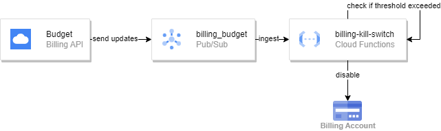

# GCP Billing Kill Switch
Since hyperscalers do not support an automated way to stop billing, this repo aims to provide a way to spin up such a feature using Terraform and GCP´s native services - to avoid waking up to an exceptionally high bill because you forgot to turn off a GCE instance...

The way it works is quite simple. GCP offers a service called "budgets", which can send mails or publish to a Pub/Sub topic once a defined threshold is reached. This mechanism is used to trigger a Cloud Function that will disable the project´s billing account.

**Disclamer: Disabling billing on a project may result in data loss. The account can be manually reactivated but Google does not guarantee that all services remain in place.**
<cite> -- cf. [Google Cloud, Disable billing for a project](https://cloud.google.com/billing/docs/how-to/modify-project?hl=en#disable_billing_for_a_project) </cite>

<!-- BEGIN_TF_DOCS -->
## Requirements

| Name | Version |
|------|---------|
|  [terraform](#requirement\_terraform) | >= 1.0 |
|  [google](#requirement\_google) | >= 4.57.0 |

## Providers

| Name | Version |
|------|---------|
|  [archive](#provider\_archive) | 2.3.0 |
|  [google](#provider\_google) | 4.61.0 |

## Modules

No modules.

## Resources

| Name | Type |
|------|------|
| [google_billing_account_iam_member.admin](https://registry.terraform.io/providers/hashicorp/google/latest/docs/resources/billing_account_iam_member) | resource |
| [google_billing_budget.default](https://registry.terraform.io/providers/hashicorp/google/latest/docs/resources/billing_budget) | resource |
| [google_cloudfunctions2_function.function](https://registry.terraform.io/providers/hashicorp/google/latest/docs/resources/cloudfunctions2_function) | resource |
| [google_pubsub_topic.budget_topic](https://registry.terraform.io/providers/hashicorp/google/latest/docs/resources/pubsub_topic) | resource |
| [google_service_account.cloud_function_sa](https://registry.terraform.io/providers/hashicorp/google/latest/docs/resources/service_account) | resource |
| [google_storage_bucket_object.object](https://registry.terraform.io/providers/hashicorp/google/latest/docs/resources/storage_bucket_object) | resource |
| [archive_file.archive_cloud_function](https://registry.terraform.io/providers/hashicorp/archive/latest/docs/data-sources/file) | data source |
| [google_billing_account.account](https://registry.terraform.io/providers/hashicorp/google/latest/docs/data-sources/billing_account) | data source |

## Inputs

| Name | Description | Type | Default | Required |
|------|-------------|------|---------|:--------:|
|  [billing\_account](#input\_billing\_account) | ID of the billing account to attach the budget to | `string` | n/a | yes |
|  [budget](#input\_budget) | Max. monthly budget | `number` | `15` | no |
|  [currency](#input\_currency) | Currency to be used for the budget | `string` | `"EUR"` | no |
|  [functions\_sa\_email](#input\_functions\_sa\_email) | Email of a pre-defined service account with roles/billing.admin permission. Defaults to: null | `string` | `null` | no |
|  [project\_id](#input\_project\_id) | n/a | `string` | n/a | yes |
|  [region](#input\_region) | Region to create resources in | `string` | n/a | yes |
|  [storage\_bucket](#input\_storage\_bucket) | Name of the storage bucket where the central cloud function will be placed | `string` | n/a | yes |

## Outputs

| Name | Description |
|------|-------------|
|  [billing\_budget\_id](#output\_billing\_budget\_id) | ID of the created billing budget |
|  [cloud\_function\_id](#output\_cloud\_function\_id) | ID of the cloud function managing the billing account |
<!-- END_TF_DOCS -->